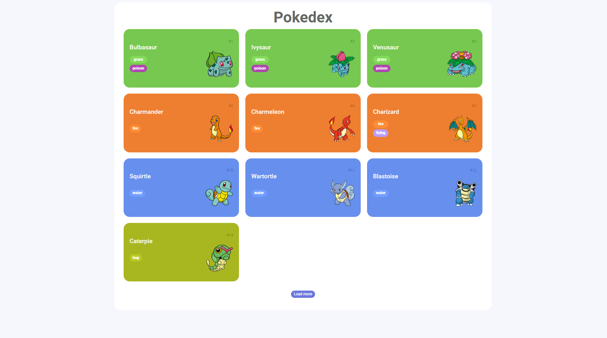
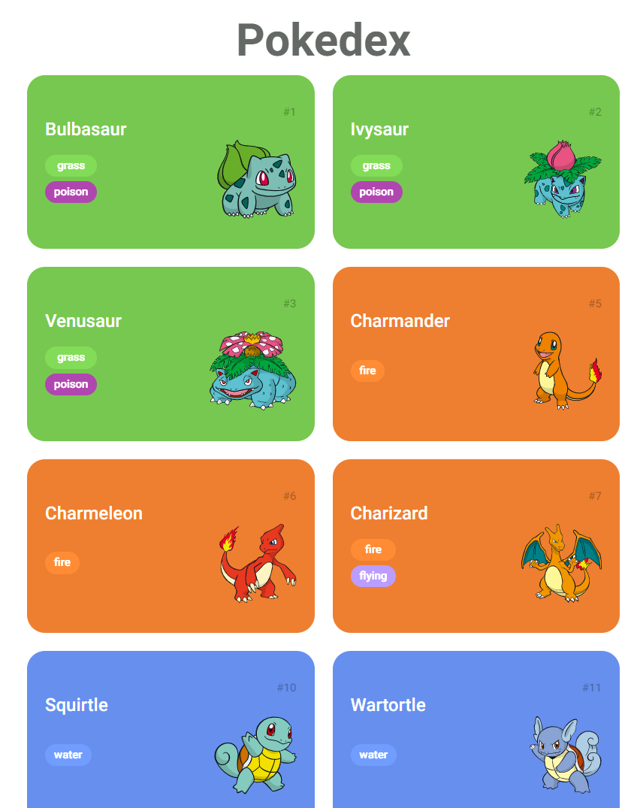

## 👨‍🏫Projeto
**Tudo sobre o Pokemon API** uma aplicação simples com intuito de mostrar em tela alguns pokemons e seus poderes com suas respectivas cores e evoluções, após o clique no Load More, ele irá renderizar mais pokemons. Feita com requisição da API de Pokemon com o método nativa do Browser, Fetch.
<br />
<br />

<br />
<br />

**Responsividade** Design 100% responsivo para todos os dispositivos.
<br />
<br />

<br />
<br />


## 👨🏻‍💻Tecnologias usadas
Este projeto foi desenvolvido utilizando as seguintes tecnologias:
  * HTML5
  * CSS3
  * JavaScript

## ▶️Como rodar
  
 ### **Passo a passo para rodar a aplicação**  
1. Faça o clone do repositório :

```sh
  $ git clone https://github.com/pedrinw/Pokemon-Api.git
```

2. Executando a Aplicação:

```sh
  $ run with live server
```
  
## 🚀Quem proporcionou a execução desse projeto?
O projeto foi desenvolvido no curso de Consumindo API com JavaScript ministrado pela DIO(Digital Innovation One)

## 👨🏻‍🚀Meus agradecimentos
Fica aqui meu profundo obrigado a **[DIO](https://www.dio.me)**

<h4 align="center">
    👨🏻‍🚀 Feito por Pedro Henrique
</h4>